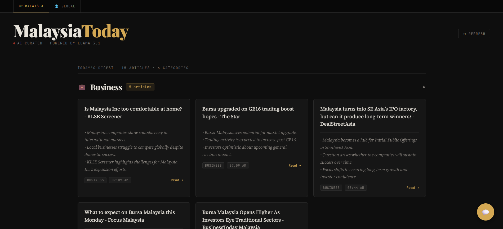
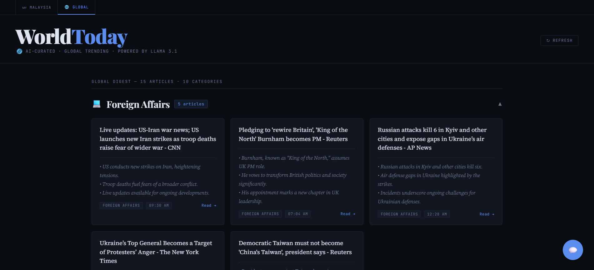

# MalaysiaToday — AI News Aggregator

A fully local, private AI news aggregator for Malaysian (and global) news. No API costs. No subscriptions. No data leaving your machine.

Fetches today's news from Google News RSS, classifies and summarises each article using a local LLM via Ollama, and serves a clean editorial UI with an AI chat agent you can query in plain language.

---

## Screenshots

### Malaysia Feed


### Global Feed


### AI Chat Agent


---

## Features

- **Today's news only** — filters Google News RSS to articles published today
- **LLM classification** — categories like Business, Foreign Affairs, Crime & Law generated by the model, not keyword rules
- **AI summaries** — 2–3 bullet points per article, generated locally
- **Malaysia / Global tabs** — switch between local and international feeds
- **AI chat agent** — ask questions in plain language; the agent searches today's cached articles and synthesises answers using a ReAct loop
- **SQLite cache** — articles cached per-day so page reloads are instant; cache persists across restarts
- **Refresh button** — bust the cache and fetch fresh articles on demand
- **Fully local** — Ollama runs on your machine; no OpenAI, no cloud LLM, zero per-query cost

---

## Tech Stack

| Layer | Tech |
|---|---|
| Web framework | Flask |
| RSS parsing | feedparser |
| Article extraction | trafilatura |
| HTTP | requests |
| LLM inference | Ollama (llama3.1 or llama3.2) |
| Persistence | SQLite (WAL mode) |
| Frontend | Jinja2 + vanilla JS |

---

## Project Structure

```
malaysia-today/
├── app.py          # Flask routes: GET /, POST /refresh, POST /chat
├── scraper.py      # Two-phase fetch pipeline (HTTP workers + LLM workers)
├── llm.py          # Ollama wrapper: analyse(), icon_for(), normalise()
├── agent.py        # ReAct agent loop with 4 tools
├── db.py           # SQLite helpers: init, cache, save, prune
├── templates/
│   └── index.html  # Dark editorial UI with tabs, accordions, chat panel
└── requirements.txt
```

---

## How It Works

**Scraping (Phase 1 — 10 HTTP workers)**
Fetches up to 100 entries from Google News RSS, filters to today's articles, resolves Google redirect URLs, and attempts article text extraction in priority order: outlet RSS feed → trafilatura → RSS summary → headline only.

**LLM Analysis (Phase 2 — 3 LLM workers)**
Each article makes a single Ollama call asking for both `CATEGORY:` and `SUMMARY:` in one structured prompt. Categories are free-form (the model invents them) and fuzzy-deduplicated so "Economy" and "Economics" collapse to the same group.

**Caching**
Processed articles are stored in `news.db` keyed by URL and date. Subsequent page loads within the same day skip the LLM entirely and serve from the DB. Articles older than 3 days are pruned on startup.

**Agent**
The chat panel (`POST /chat`) runs a ReAct loop (max 6 turns) with 4 tools grounded in the local DB:
- `get_news_summary` — overview of today's articles by category
- `search_articles(keyword)` — full-text search across titles, summaries, and body text
- `ask_about_topic(topic)` — synthesises an answer from relevant articles
- `get_digest` — 5-bullet daily brief

---

## Setup

**Requirements:** Python 3.11+, [Ollama](https://ollama.com)

```bash
# 1. Clone the repo
git clone https://github.com/CCZ1004/malaysia-today.git
cd malaysia-today

# 2. Install Python dependencies
pip install -r requirements.txt

# 3. Pull the LLM (choose one)
ollama pull llama3.2        # faster, ~2.5 GB RAM
ollama pull llama3.1:8b     # better quality, ~6 GB RAM

# 4. Run
python app.py
```

Open [http://localhost:5000](http://localhost:5000). The first load will be slow (30–60s) while articles are fetched and processed. Subsequent loads within the same day are instant.

---

## Configuration

All tuneable constants are at the top of their respective files:

| File | Constant | Default | Notes |
|---|---|---|---|
| `llm.py` | `MODEL` | `"llama3.2"` | Change to `"llama3.1:8b"` for better quality |
| `db.py` | `DB_PATH` | `news.db` | SQLite database location |
| `db.py` | `keep_days` | `3` | Days of articles to retain |
| `agent.py` | `MAX_TURNS` | `6` | Max ReAct loop iterations |

---

## Notes

- Most Malaysian news sites (The Star, Malaysiakini, NST) are paywalled or JS-rendered, so trafilatura often falls back to RSS snippets. Summaries on short content are inferred from headlines.
- `llama3.1:8b` is meaningfully better for the agent's ReAct format compliance. Use it if your machine has 8 GB+ RAM.
- The `trafilatura` logger is suppressed at ERROR level — the "discarding data" warnings are expected and not actionable.

---

## Author

**Chiu Chang Ze** — AI/ML Engineer  
[GitHub: CCZ1004](https://github.com/CCZ1004)
